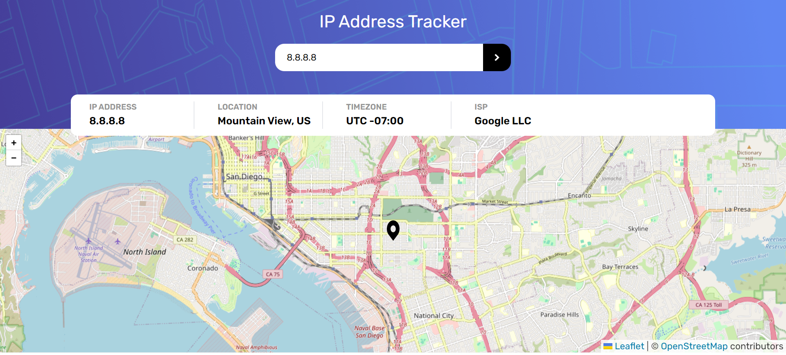

# IP Address Tracker

This project is an IP Address Tracker built with React and Leaflet. It allows users to search for any IP address or domain and displays its location on a map.

## Screenshot

## Author

- Website - [Kaushik Verma](https://portfolio-six-teal-24.vercel.app/)
- Linkedin - [@kaushik-verma-2b5515254](https://www.linkedin.com/in/kaushik-verma-2b5515254/)
- Twitter - [@SilentK68296830](https://x.com/SilentK68296830)

## Links

- Solution URL: [Add solution URL here](https://your-solution-url.com)
- Live Site URL: [Add live site URL here](https://your-live-site-url.com)
